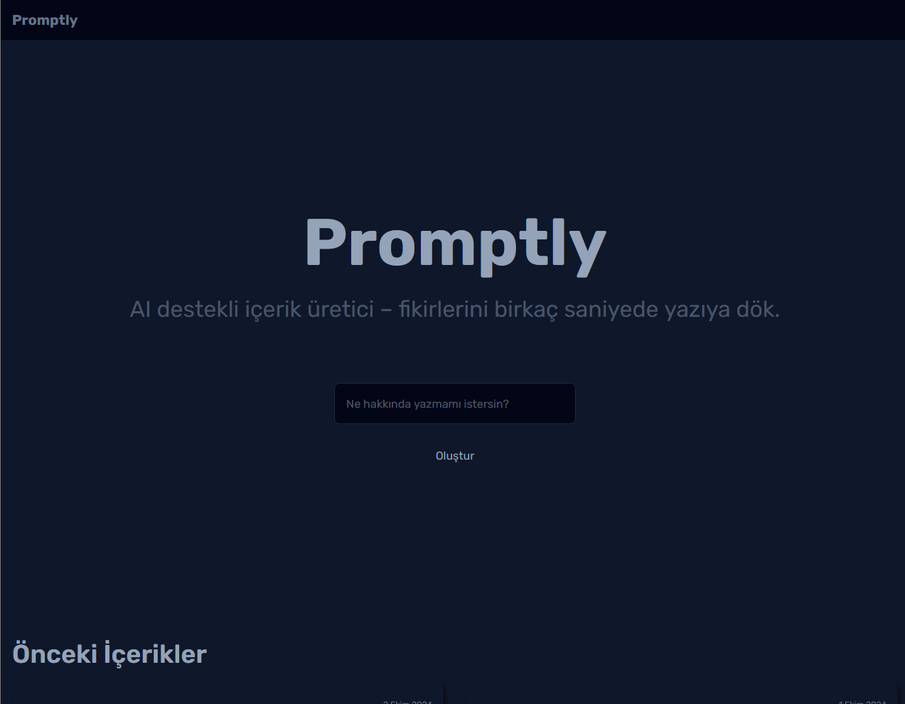

# Promptly — AI Destekli İçerik Üretici



---

## Açıklama

Promptly, kullanıcıların basit bir metin girdisiyle profesyonel ve markdown formatında zengin içerik oluşturmasını sağlayan bir AI destekli web uygulamasıdır. OpenAI GPT-3.5 Turbo modeli kullanılarak oluşturulan içerikler, kullanıcıya hem önizleme hem de detaylı okuma imkanı sunar.

---

## Özellikler

- Kullanıcı dostu, sade ve responsive arayüz
- Tek seferde 3 içerik oluşturma sınırı ile maliyet kontrolü
- Markdown formatında çıktı desteği ve zengin içerik yapısı
- Üretilen içeriklerin listelenmesi ve detay sayfasında gösterimi
- Özel 404 sayfası ile kullanıcı yönlendirme
- Zustand ile global state yönetimi ve localStorage kalıcılığı

---

## Teknolojiler

- Next.js 15 (App Router)
- React & React Hooks
- Zustand (State Management)
- Tailwind CSS & @tailwindcss/typography
- OpenAI API (GPT-3.5 Turbo)
- React Markdown
- Vercel (Deployment)

---

## Kurulum ve Çalıştırma

1. Depoyu klonlayın:

   ```bash
    git clone https://github.com/varisDogukan/promptly.git
   cd promptly
   ```

2. Gerekli paketleri yükleyin:

   ```bash
     npm install
   ```

3. .env.local dosyasını oluşturun ve OpenAI API anahtarınızı ekleyin:

   ```bash
     OPENAI_API_KEY=sk-...
   ```

4. Projeyi başlatın:

   ```bash
     npm run dev
   ```

5. Tarayıcıda http://localhost:3000 adresini açın.

---

## Canlı Demo
[🔗 Canlı Demo](https://promptly-sooty.vercel.app)


---

## Not:

Bu proje, portföyümde modern frontend yeteneklerimi göstermek amacıyla geliştirilmiştir.
Gerçek dünya problemlerini çözmeye yönelik, AI ve UI/UX odaklı bir yaklaşımla inşa edilmiştir.
